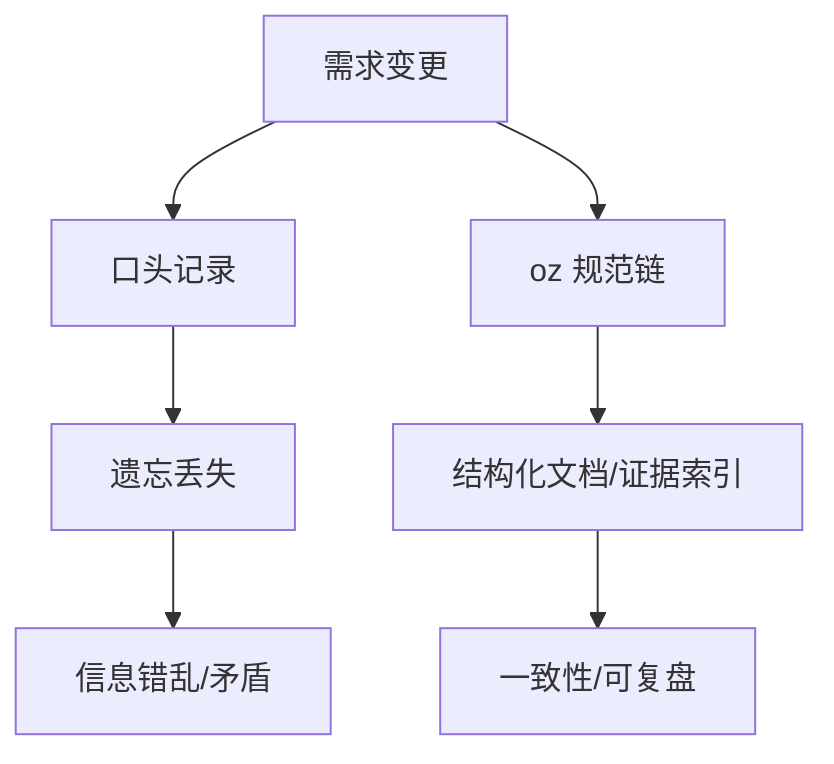
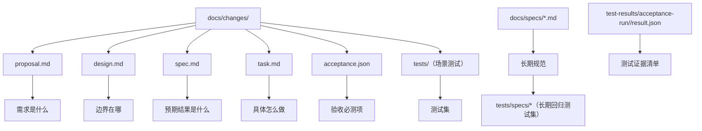
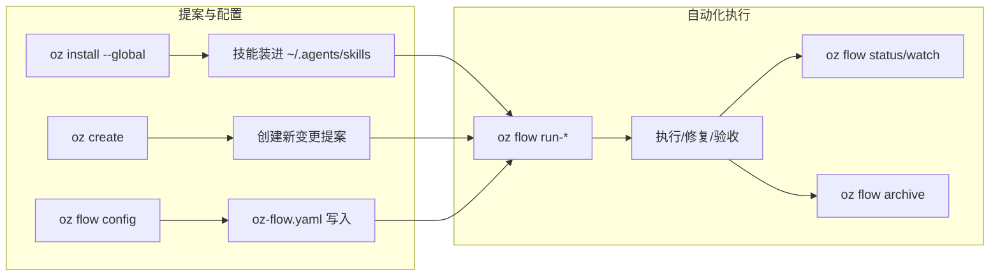

中文精简版 Openspec 规范工具和工作流执行器

## 动机

智能体编程一不小心就会变成天马行空的 vibe coding。AI 时代的编程瓶颈早已不是代码的读写速度了，而是需求是否对齐，以及变更历史是否详细可复查。



## 提案入口

oz 按变更大小选择 micro、small、standard 三种入口。数量只作为分类信号，不是凑测试或凑任务的门槛。

| 类型 | 适用场景 | 产物 |
| --- | --- | --- |
| micro | 不改变用户可感知行为、命令契约、状态语义或长期规格的纯实现修复 | TDD + git commit，不创建 change 目录 |
| small | 单一业务意图，最多 2 个验收场景或 2 个 required tests，且没有复杂设计分歧 | `docs/changes/<编号-中文需求>/brief.md`、`acceptance.json`、`tests/` |
| standard | 中大型、高风险、跨模块、多场景，或超过 small 上限 | 完整提案：`brief.md`、`proposal.md`、`design.md`、`spec.md`、`task.md`、`acceptance.json`、`tests/` |

```text
是否改变行为或长期规格？
        |
        +-- 否：micro
        |
        +-- 是，但范围小：small
        |
        +-- 是，且跨模块/高风险/多场景：standard
```

small 仍必须写清长期规格去向，归档时必须把长期行为合并进 `docs/specs/`，把测试意图合并进 `tests/specs/`。standard 升级触发器包括跨模块影响、高风险迁移、多个业务场景、超过 2 个验收场景或超过 2 个 required tests；standard 不得为了显得“够大”硬凑测试或任务。

运行 `oz archive <change> --yes` 时，CLI 会迁移提案（含 `tests/`），并将测试脚本、验收合同和文档中的相对测试引用同步改为归档路径；长期测试合并仍由归档技能按业务能力完成。

## 核心产物关系

每个 small 或 standard 活跃变更都放在 `docs/changes/<编号-中文需求>/`。目录名必须包含数字编号和至少一个中文汉字，例如 `12-重写-oz-cli`；这样可以避免全英文短名在长期历史中变得含糊。



## 命令入口



## 最少命令清单

```bash
go install github.com/xbugs221/oz@latest
oz install --global
oz flow config
# 唤起coding-agent比如codex/pi，要求创建新提案，完成后退出
oz flow run
oz flow watch
```

`oz-flow.yaml` 的配置合并顺序是：

```text
内置默认 -> ~/oz-flow.yaml -> 仓库 oz-flow.yaml -> 本次 run 快照
```

常见门禁配置：

```yaml
validation:
  limit: 3
  commands:
    - go test ./...
```

## 局限性

如果只是一些轻量更改，比如前端样式的微调，没有必要硬套用这个工具。oz更适合中大规模的变更，据此什么样的变更算大规模，这个见仁见智，也和执行任务的具体agent的智能程度有关
