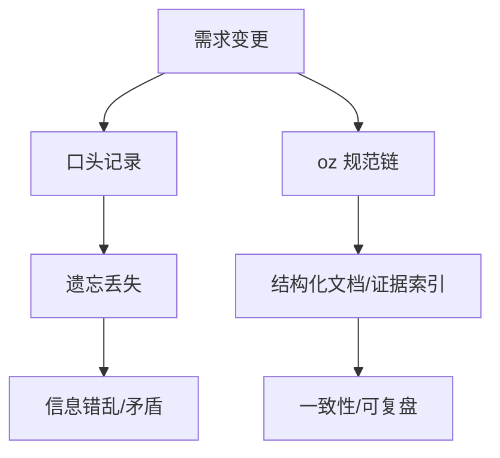
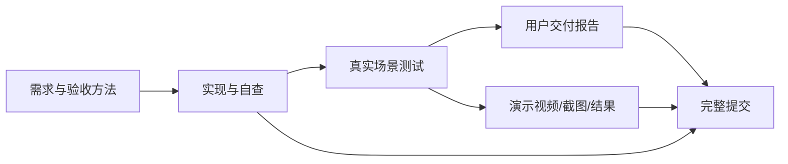
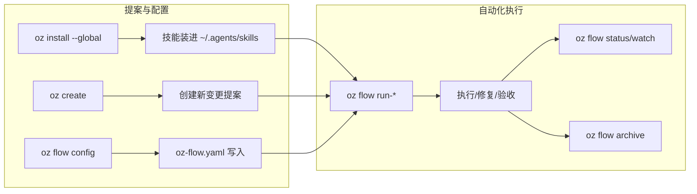
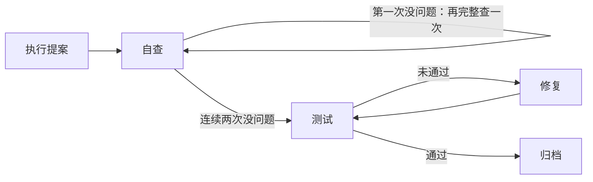

中文精简版 OpenSpec 规范工具和工作流执行器，把需求、实现、验收材料和交付说明归入同一次可复查的提交。

## 动机

智能体编程一不小心就会变成天马行空的 vibe coding。AI 时代的编程瓶颈早已不是代码的读写速度了，而是需求是否对齐，以及变更历史是否详细可复查。


```mermaid
flowchart TD
    P[需求变更] --> Q["口头记录"]
    P --> R["oz 规范链"]
    Q --> S["遗忘丢失"]
    S --> S2["信息错乱/矛盾"]
    R --> T["结构化文档/证据索引"]
    T --> U["一致性/可复盘"]
```

## 提案入口

oz 按变更大小选择 micro、small、standard 三种入口。数量只作为分类信号，不是凑测试或凑任务的门槛。

| 类型 | 适用场景 | 产物 |
| --- | --- | --- |
| micro | 不改变用户可感知行为、命令契约、状态语义或长期规格的纯实现修复 | TDD + git commit，不创建 change 目录 |
| small | 单一业务意图，最多 2 个验收场景或 2 项必测内容，且没有复杂设计分歧 | `docs/changes/<编号-中文需求>/brief.md`、`acceptance.json`、`tests/` |
| standard | 中大型、高风险、跨模块、多场景，或超过 small 上限 | 完整提案：`brief.md`、`proposal.md`、`design.md`、`spec.md`、`acceptance.json`、`tests/` |

```text
是否改变行为或长期规格？
        |
        +-- 否：micro
        |
        +-- 是，但范围小：small
        |
        +-- 是，且跨模块/高风险/多场景：standard
```

small 仍必须写清长期规格去向，归档时必须把长期行为合并进 `docs/specs/`，把测试意图合并进 `tests/specs/`。standard 升级触发器包括跨模块影响、高风险迁移、多个业务场景、超过 2 个验收场景或超过 2 项必测内容；standard 不得为了显得“够大”硬凑测试或任务。

运行 `oz archive <change> --yes` 时，CLI 只接受已经生成提交级证据包的提案，再迁移提案（含 `tests/`），并将测试脚本、验收合同和文档中的相对测试引用同步改为归档路径；长期测试合并仍由归档技能按业务能力完成。

## 一次提案最终留下什么

每个 small 或 standard 提案都放在 `docs/changes/<编号-中文需求>/`。目录名包含编号和中文需求，例如 `12-重写-oz-cli`，方便长期查找。


```mermaid
flowchart LR
    R["需求与验收方法"] --> I["实现与自查"]
    I --> T["真实场景测试"]
    T --> D["用户交付报告"]
    T --> E["演示视频/截图/结果"]
    D --> C["完整提交"]
    E --> C
    I --> C
```

提案通过后，最终材料保存在 `tests/evidence/proposals/<change>/`：

- `DELIVERY.md`：普通审核人员可以照着完成验收。
- 演示视频：展示提案要求的能力，格式不限，以能直接播放为准。
- 修复前后对比：截图、视频、日志或结果文件均可，但必须让人一眼看出变化。
- 最终验收结果：只保留通过轮次，避免后续测试覆盖已经确认的材料。

这些材料会和实现、测试、归档提案进入同一次提交。`test-results/` 只保存可重新生成的临时结果，不进入 Git。

活动提案不使用 `task.md`。创建阶段只定义目标、边界和验收方法，具体实现步骤由执行器根据当前结果动态安排。

## 命令入口


```mermaid
flowchart LR
    subgraph 提案与配置
      I["oz install --global"] --> J["技能装进 ~/.agents/skills"]
      K["oz create"] --> L["创建新变更提案"]
      M["oz flow config"] --> N["oz-flow.yaml 写入"]
    end
    subgraph 自动化执行
      X["oz flow run-*"] --> Y["执行/修复/验收"]
      Y --> Z["oz flow status/watch"]
      Y --> W["oz flow archive"]
    end
    J --> X
    L --> X
    N --> X
```

## 最少命令清单

```bash
go install github.com/xbugs221/oz@latest
oz install --global
oz flow config
# 唤起coding-agent比如codex/pi/agy/claude，要求创建新提案，完成后退出
oz flow run
oz flow watch
```

`oz-flow.yaml` 的配置合并顺序是：

```text
内置默认 -> ~/oz-flow.yaml -> 仓库 oz-flow.yaml -> 本次 run 快照
```

`oz flow config` 只生成这一份内嵌默认配置，并且仅支持可选的 `--global`。不再提供 profile、`--profile` 或 `--list-profiles`；需要差异化行为时，直接编辑生成的 `oz-flow.yaml`。

项目需要执行额外检查时，可以在 `oz-flow.yaml` 中配置验证命令：

```yaml
max_audit_iterations: 3
validation:
  limit: 3
  commands:
    - go test ./...
```

`max_audit_iterations` 限制进入独立测试前的全量自查轮数，默认 `3`；设为 `0` 可保留不限轮次行为。

## 工作流如何收敛

`oz flow` 允许智能体持续自我优化，但每一步都会明确进入下一阶段，不会原地死循环。


```mermaid
flowchart LR
    E["执行提案"] --> U["自查"]
    U -->|"发现问题：修正后继续查"| U
    U -->|"第一次没问题：再完整查一次"| U
    U -->|"连续两次没问题"| Q["测试"]
    Q -->|"未通过"| F["修复"]
    F --> Q
    Q -->|"通过"| A["归档"]
```

- 自查可以多轮优化；达到 `max_audit_iterations` 后直接进入独立测试，不再继续自查。
- 连续两次完整自查都没有发现问题，才会开始独立测试。
- 测试未通过时只修复实际发现的问题，然后继续测试，直到通过。
- 每次进入独立测试前，执行/自查 skill 会先运行仓库提交前钩子，吸收改动并再次运行确认文件稳定；随后重跑测试并建立快照，归档阶段不得首次触发文件改写。
- 缺少账号、配置或外部服务时会暂停并说明原因；相同失败长期没有变化时也会停止空转。
- 归档前会生成普通人可读的交付报告，并确认链接的截图、视频或结果文件能够直接审核。

### 三类归档

| 入口 | 作用 |
| --- | --- |
| `oz archive <change> --yes` | 把活动提案迁入 `docs/changes/archive/`，并更新提案内路径引用 |
| 工作流自动归档 | 测试通过后生成交付报告和证据包，再归档提案、长期规格与测试 |
| `oz flow archive` | 仅归档已经失败的 run/batch 运行记录，不等于完成提案交付 |

环境或输入补齐后，可以执行 `oz flow restart` 从暂停位置继续。只有无法继续的运行才会保存失败记录；`oz flow archive` 不会把失败运行误当成已经完成的提案。

## 发布与本地验证

版本变化见 [CHANGELOG.md](CHANGELOG.md)。GitHub Actions 的 CI 和 Release 都会运行 `go test ./...`；版本标签触发 Release 时，发布页会自动使用对应版本或“尚未发布”部分作为说明，并附带完整更新日志。

本地复现 GitHub CI：

```bash
go test ./...
bash scripts/extract-release-notes.sh CHANGELOG.md v0.0.0-local /tmp/oz-release-notes.md
```

## 与外部认知子技能的集成

oz 内置技能（`oz-plan`、`oz-create`、`oz-exec`、`oz-archive`）负责守住 Oz 的合同边界与证据链。在阶段内部需要更强的对话、规划、实现或诊断能力时，可以由对应内置技能点名调用外部 Matt Pocock 技能作为**认知子程序**。

| Oz 阶段 | 可辅助调用的外部技能 | 作用 |
| --- | --- | --- |
| planning | `/grill-with-docs`、`/wayfinder`、`/domain-modeling` | 对齐意图、绘制决策地图、统一术语 |
| create | `/to-spec`、`/to-tickets`、`/prototype`、`/domain-modeling` | 生成 spec、拆票、原型验证 |
| exec | `/implement`、`/tdd`、`/code-review`、`/prototype`、`/diagnosing-bugs`、`/codebase-design` | 红绿实现、交付前 review、顽固 bug 诊断 |
| archive | `/writing-for-agents`、`/domain-modeling` | 润色 DELIVERY.md、沉淀术语 |

这些外部技能**不由 `oz install` 安装**，需要单独安装到 harness 技能目录（如 `~/.claude/skills` 或 `~/.agents/skills`）。Oz 技能只以斜杠命令唤起它们，不复制其内部流程；外部技能不得绕过 Oz 的硬合同（`acceptance.json`、`tests/`）和只读边界。

## 局限性

如果只是一些轻量更改，比如前端样式的微调，没有必要硬套用这个工具。oz更适合中大规模的变更，据此什么样的变更算大规模，这个见仁见智，也和执行任务的具体agent（codex/pi/agy/claude 等）的智能程度有关
