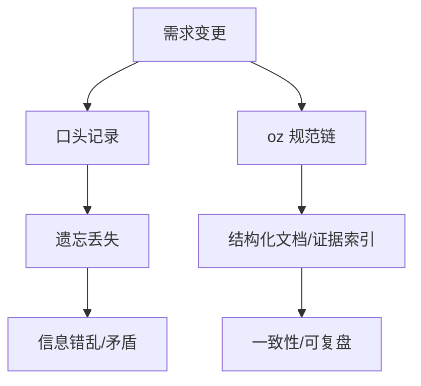
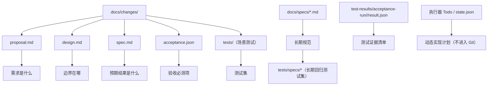
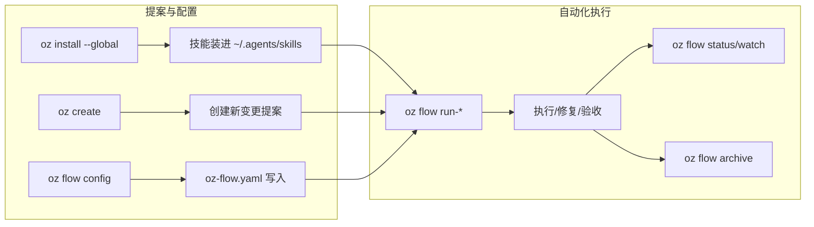
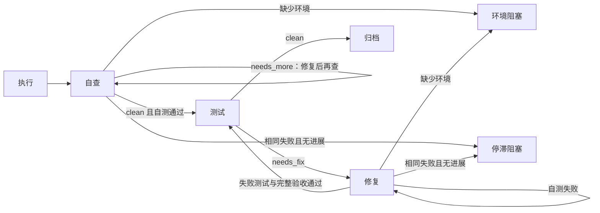

中文精简版 Openspec 规范工具和工作流执行器

## 动机

智能体编程一不小心就会变成天马行空的 vibe coding。AI 时代的编程瓶颈早已不是代码的读写速度了，而是需求是否对齐，以及变更历史是否详细可复查。


```mermaid
flowchart TD
    P[需求变更] --> Q["口头记录"]
    P --> R["oz 规范链"]
    Q --> S["遗忘丢失"]
    S --> S2["信息错乱/矛盾"]
    R --> T["结构化文档/证据索引"]
    T --> U["一致性/可复盘"]
```

## 提案入口

oz 按变更大小选择 micro、small、standard 三种入口。数量只作为分类信号，不是凑测试或凑任务的门槛。

| 类型 | 适用场景 | 产物 |
| --- | --- | --- |
| micro | 不改变用户可感知行为、命令契约、状态语义或长期规格的纯实现修复 | TDD + git commit，不创建 change 目录 |
| small | 单一业务意图，最多 2 个验收场景或 2 个 required tests，且没有复杂设计分歧 | `docs/changes/<编号-中文需求>/brief.md`、`acceptance.json`、`tests/` |
| standard | 中大型、高风险、跨模块、多场景，或超过 small 上限 | 完整提案：`brief.md`、`proposal.md`、`design.md`、`spec.md`、`acceptance.json`、`tests/` |

```text
是否改变行为或长期规格？
        |
        +-- 否：micro
        |
        +-- 是，但范围小：small
        |
        +-- 是，且跨模块/高风险/多场景：standard
```

small 仍必须写清长期规格去向，归档时必须把长期行为合并进 `docs/specs/`，把测试意图合并进 `tests/specs/`。standard 升级触发器包括跨模块影响、高风险迁移、多个业务场景、超过 2 个验收场景或超过 2 个 required tests；standard 不得为了显得“够大”硬凑测试或任务。

运行 `oz archive <change> --yes` 时，CLI 会迁移提案（含 `tests/`），并将测试脚本、验收合同和文档中的相对测试引用同步改为归档路径；长期测试合并仍由归档技能按业务能力完成。

## 核心产物关系

每个 small 或 standard 活跃变更都放在 `docs/changes/<编号-中文需求>/`。目录名必须包含数字编号和至少一个中文汉字，例如 `12-重写-oz-cli`；这样可以避免全英文短名在长期历史中变得含糊。


```mermaid
flowchart TD
    C["docs/changes/<N-需求>"] --> P["proposal.md"]
    P --> P1["需求是什么"]
    C --> D["design.md"]
    D --> D1["边界在哪"]
    C --> S["spec.md"]
    S --> S1["预期结果是什么"]
    C --> A["acceptance.json"]
    A --> A1["验收必测项"]
    C --> UT["tests/（场景测试）"]
    UT --> UT1["测试集"]
    M["docs/specs/*.md"] --> LM["长期规范"]
    LM --> RS["tests/specs/*（长期回归测试集）"]
    R["test-results/acceptance-run/<change>/result.json"] --> E["测试证据清单"]
    RT["执行器 Todo / state.json"] --> DP["动态实现计划（不进入 Git）"]
```

active 提案禁止包含 `task.md`。创建阶段定义目标、边界和验收合同，具体步骤由执行器在 Todo 或运行态中动态决策；历史归档中的旧任务文件只作为历史资料保留。

## 命令入口


```mermaid
flowchart LR
    subgraph 提案与配置
      I["oz install --global"] --> J["技能装进 ~/.agents/skills"]
      K["oz create"] --> L["创建新变更提案"]
      M["oz flow config"] --> N["oz-flow.yaml 写入"]
    end
    subgraph 自动化执行
      X["oz flow run-*"] --> Y["执行/修复/验收"]
      Y --> Z["oz flow status/watch"]
      Y --> W["oz flow archive"]
    end
    J --> X
    L --> X
    N --> X
```

## 最少命令清单

```bash
go install github.com/xbugs221/oz@latest
oz install --global
oz flow config
# 唤起coding-agent比如codex/pi，要求创建新提案，完成后退出
oz flow run
oz flow watch
```

`oz-flow.yaml` 的配置合并顺序是：

```text
内置默认 -> ~/oz-flow.yaml -> 仓库 oz-flow.yaml -> 本次 run 快照
```

`oz flow config` 只生成这一份内嵌默认配置，并且仅支持可选的 `--global`。不再提供 profile、`--profile` 或 `--list-profiles`；需要差异化行为时，直接编辑生成的 `oz-flow.yaml`。

职责边界：skill 说明各角色怎么做；change 目录保存需求与范围；`acceptance.json` 是测试和证据的可执行合同；`oz flow` 决定何时推进阶段并执行门禁。

常见门禁配置：

```yaml
validation:
  limit: 3
  commands:
    - go test ./...
```

## 优化为什么这样设计

`oz flow` 的目标不是多生成一份审核报告，而是让提案被充分执行，并在无人介入时修掉可稳定发现的低级 BUG。


```mermaid
flowchart LR
    E["执行"] --> U["自查"]
    U -->|"needs_more：修复后再查"| U
    U -->|"clean 且自测通过"| Q["测试"]
    Q -->|"needs_fix"| T["修复"]
    T -->|"失败测试与完整验收通过"| Q
    T -->|"自测失败"| T
    Q -->|"clean"| A["归档"]
    U -->|"缺少环境"| BE["环境阻塞"]
    T -->|"缺少环境"| BE
    U -->|"相同失败且无进展"| BS["停滞阻塞"]
    T -->|"相同失败且无进展"| BS
```

`status`、`watch`、JSON 的人类名称和 graph 可见节点统一显示“执行、自查、修复、测试、归档”。持久状态仍使用 `execution`、`audit_N`、`targeted_repair_N`、`qa_N`、`archive`，恢复与流转协议不变。

| 决策 | 原因 |
| --- | --- |
| 全量自查与定向修复复用同一后端、同一 repairer 会话 | 保留修改意图、失败尝试和排查脉络，避免每轮从头理解 |
| 每轮重读状态、验收合同、完整差异和验证结果 | 文件是权威事实，防止持续会话依据过期记忆判断 |
| 每轮写 `audit-N.json`、`targeted-repair-N.json` 或 `qa-N.json` | 把发现、修复验证和剩余问题做成可恢复、可审计的检查点 |
| QA 前持续全量自查，QA 后只定向修复 | 先覆盖当前提案完整范围，再避免 QA 打回后反复扩大修复范围 |
| 每轮 QA 使用独立会话 | 降低修复者自我确认和前一轮 QA 判断造成的盲区 |
| 不设置固定修复轮次上限 | 只要源码、测试或证据仍有进展就继续；相同失败且无变化时进入 `blocked_stalled` |
| 环境缺失单独进入 `blocked_environment` | 补齐账号、配置或外部服务后从原阶段恢复，不把环境问题伪装成代码失败 |
| 只有独立 QA clean 才能归档 | repairer 负责修复和自测，最终放行权仍属于独立 QA |

因此，会话记忆只负责“延续思路”，`state.json`、封存的 `acceptance.json`、当前差异、动态阶段 artifact 和确定性测试才构成放行证据。新运行中的 `max_repair_iterations` 仅保留为迁移诊断，不作为终止条件；已 sealed 的 `repair-v1` 与更早的 review/fix 运行仍严格按快照中的有限状态机恢复，不会被静默改写。

## 发布与本地验证

版本变化见 [CHANGELOG.md](CHANGELOG.md)。GitHub Actions 的 CI 和 Release 都会运行 `go test ./...`；版本标签触发 Release 时，发布页会自动使用对应版本或“尚未发布”部分作为说明，并附带完整更新日志。

本地复现 GitHub CI：

```bash
go test ./...
bash scripts/extract-release-notes.sh CHANGELOG.md v0.0.0-local /tmp/oz-release-notes.md
```

## 局限性

如果只是一些轻量更改，比如前端样式的微调，没有必要硬套用这个工具。oz更适合中大规模的变更，据此什么样的变更算大规模，这个见仁见智，也和执行任务的具体agent的智能程度有关
