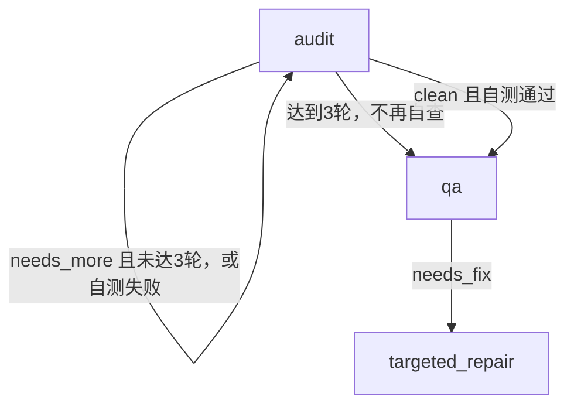

# 修复后生成结果

使用本次构建运行 `oz flow config`，生成配置默认限制三轮自查：

```yaml
max_audit_iterations: 3
stages:
  planning:
    agent: codex
    model: gpt-5.6-sol
```

同一仓库运行 `oz flow graph --change demo --format mermaid`，自查路径明确展示触顶后进入独立测试：


