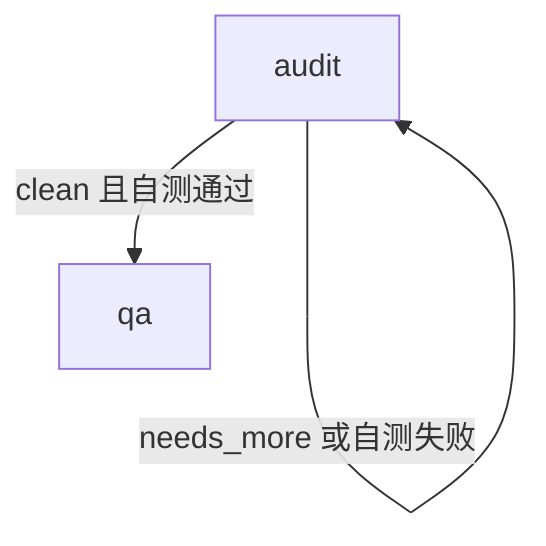

# 修复前生成结果

使用已安装的 v1.2.8 运行 `oz flow config`，生成配置直接从阶段设置开始，没有自查轮次限制：

```yaml
stages:
  planning:
    agent: codex
    model: gpt-5.6-sol
    reasoning: xhigh
```

同一仓库运行 `oz flow graph --change demo --format mermaid`，自查路径会持续循环：


